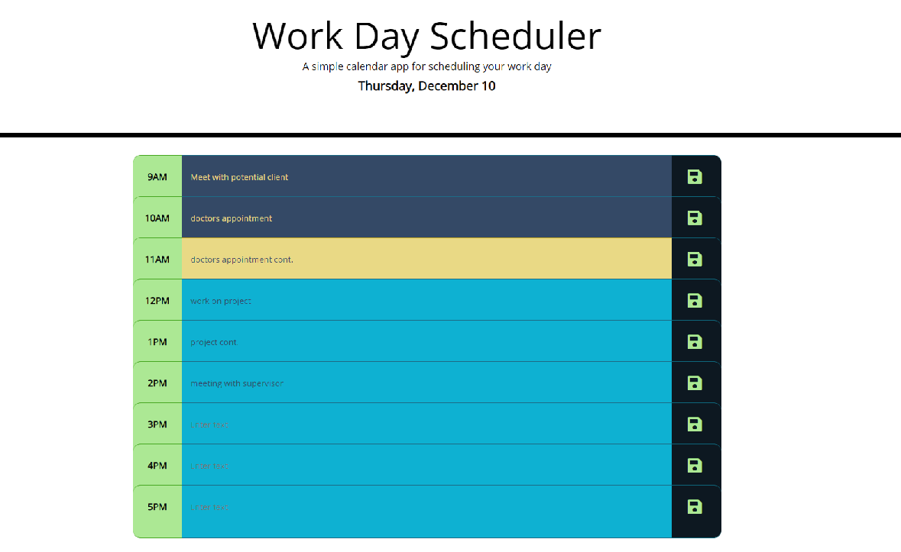

# WorkDayScheduler

## Description

This application schedules the nine to five workday hours. If the hour has passed the time slot is represented in dark blue.  Current hour is represented in yellow.  Future hours are represented in light blue. When a user clicks the time slot they are able to enter or alter text.  Pushing the green disk button allows the user to save the text.

An image of what the page would have looked like on Thursday, December 10th, 2020 at 11:45am:

[Link to GitHub page](https://github.com/Heath-Bennett/WorkDayScheduler.git)

[Link to deployed page](https://heath-bennett.github.io/WorkDayScheduler/)
